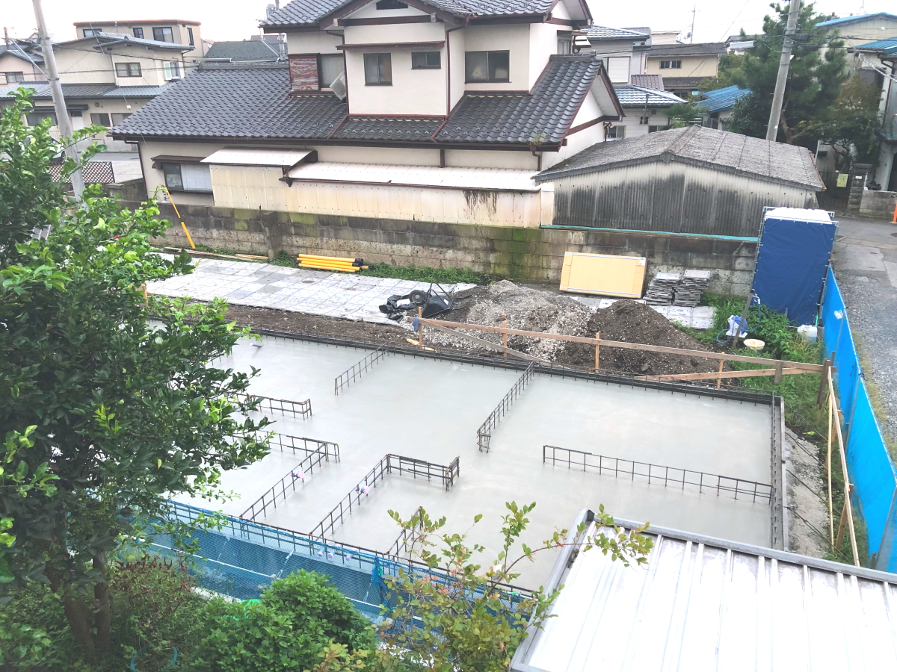
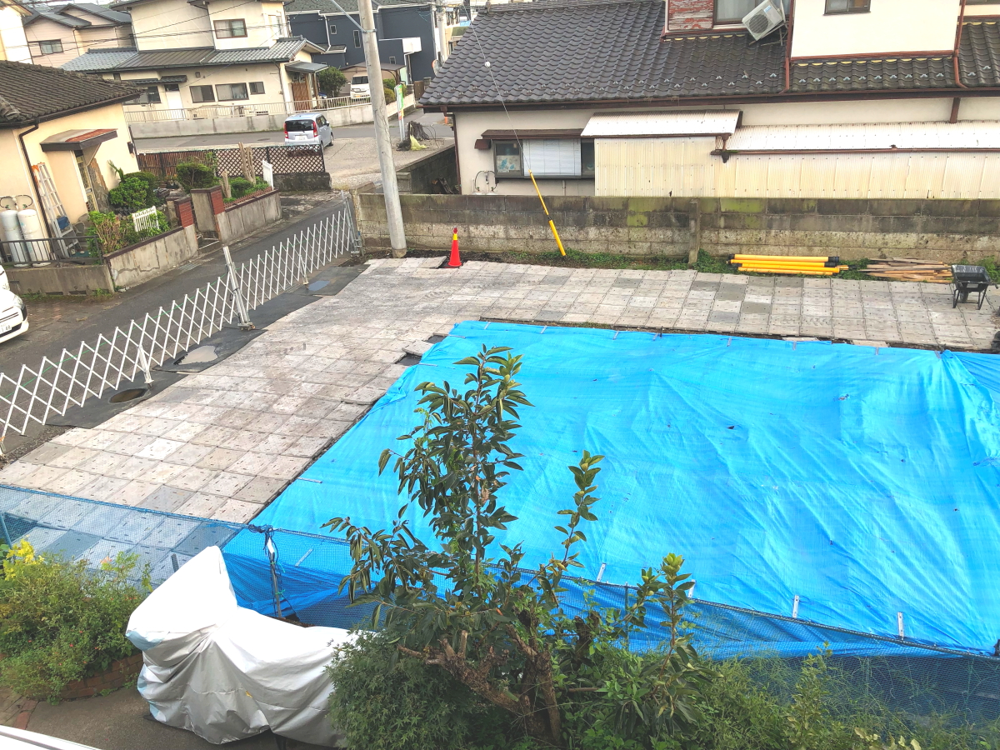
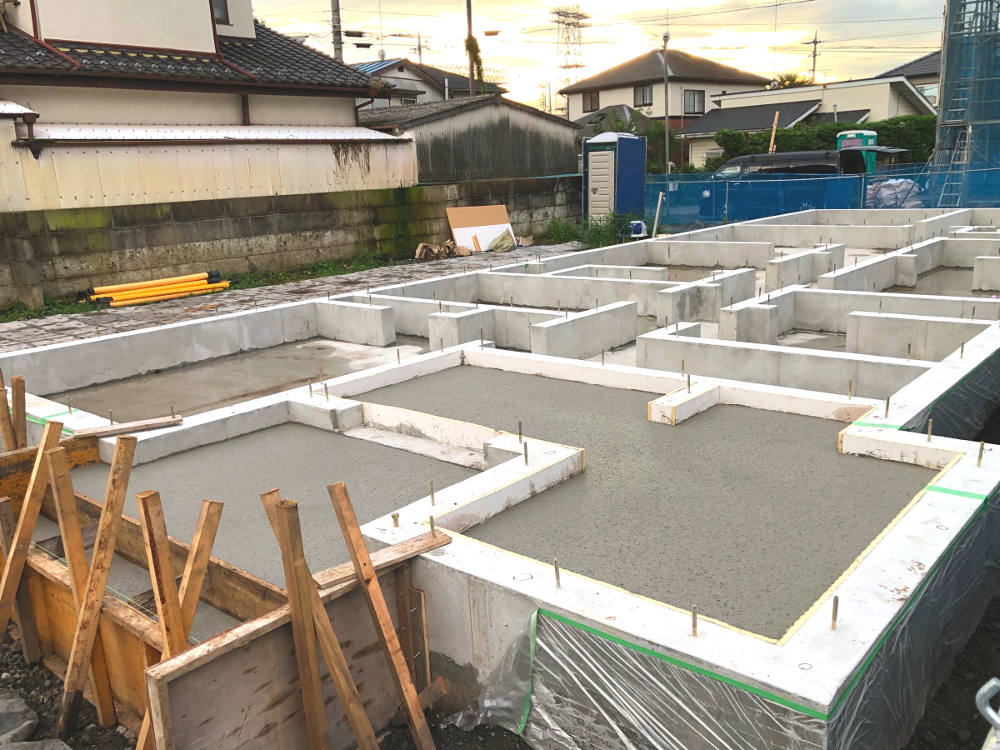
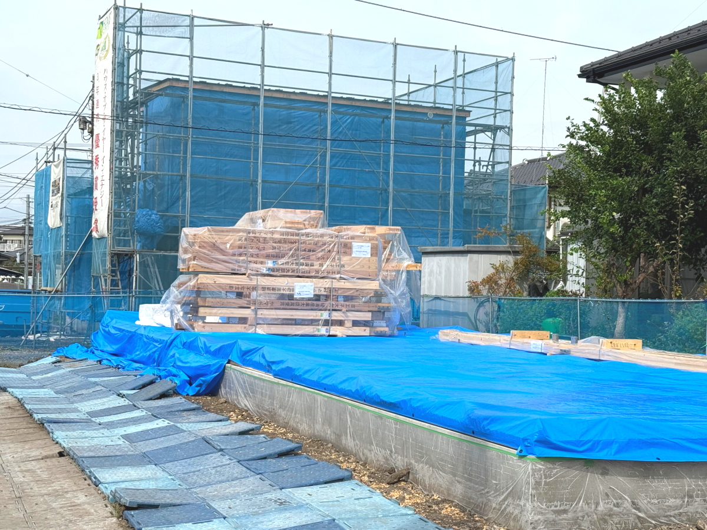
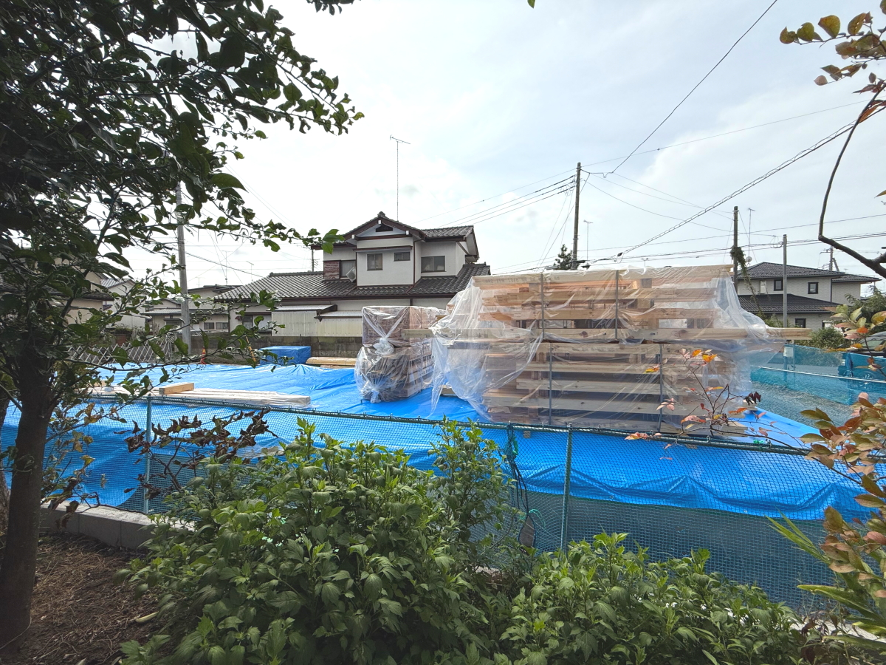
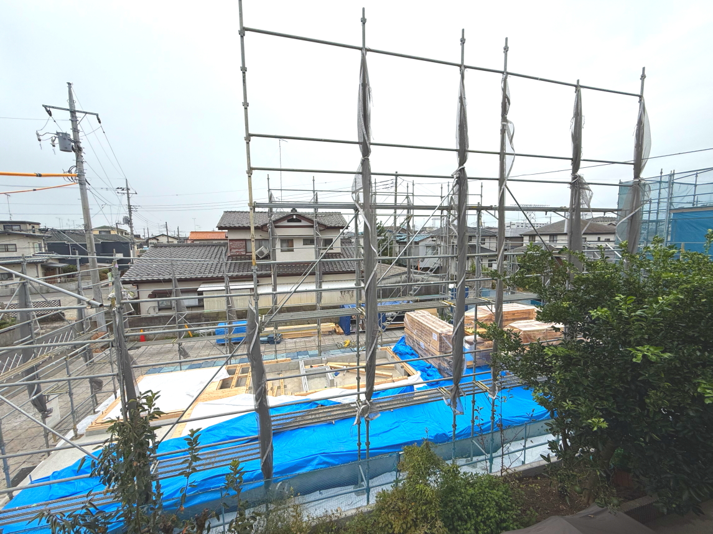
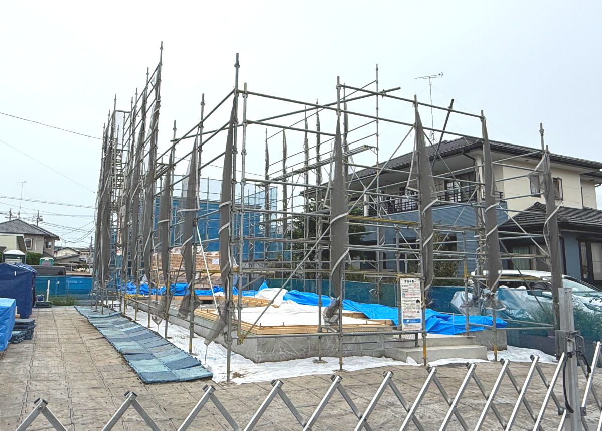
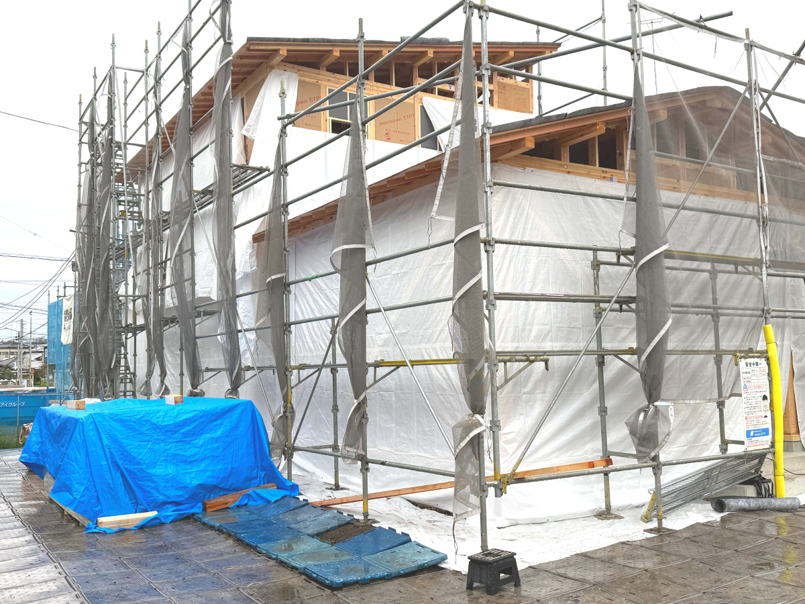

# 2024Aug_tatekae3

<html lang="ja">
 <head>
  <meta charset="utf-8" />
 

<link href="https://cdnjs.cloudflare.com/ajax/libs/lightbox2/2.7.1/css/lightbox.css" rel="stylesheet">
   
</head>
<!--
<body onload="alert('65歳まで、よく頑張りました！　まだまだ元気に〜〜(^o^)/')" onunload="alert('再会の時まで、元気でお過ごしくださいませ〜(^o^)/')">
-->

  モバイル端末をお使いの場合は、画面を横向きにするとより見やすくご覧頂けます。

 &nbsp;お隣の家が建て替え！

<a href="https://torokoid.github.io/2024Jul_tatekae/" target="_blank">建て替え_1</a>><a href="https://torokoid.github.io/2024Jul_tatekae2/" target="_blank">建て替え_2</a>>建て替え_3

<!--
<h2><a href="https://torokoid.github.io/list">クラス会名簿リンク</a></h2>
-->
  

 アクセス用QRコード

<marquee direction="right" scrollamount="20" width="30%">(^_^)/~hada</marquee>

<h2><marquee behavior="left">!!! 2024年8月7日、更地になったお隣に新築のお家が立ちます !!!</marquee></h2>
<!--

-->

<h3> ～～～8月23日(金)、地鎮祭が執り行われました～～～  </h3>

<h3> ～～～8月24日(土)、ボーリングした穴にセメントを流し込んで、しっかりした杭が完成～～～  </h3>

<h3> ～～～8月28日(水)、工事のための電力確保～～～  </h3>

<h3> ～～～9月10日(火)、杭の上にコンクリートの基礎作り～～～  </h3>

<h3> ～～～9月14日(土)、夕方の雷雨に備えてブルーシートが張られました～～～  </h3>

<h3> ～～～9月17日(火)、基礎工事がほぼ完成～～～  </h3>

<h3> ～～～9月19日(木)、コンクリートでかさ上げ、土間エリア？～～～  </h3>

<h3> ～～～9月25日(水)、基礎の上に木枠の設置作業、この作業一人で黙々と実施してます～～～  </h3>

<h3> ～～～9月26日(木)、朝の状態。この日はメンバー増強されて2人で作業となりました～～～  </h3>

<h3> ～～～9月26日(木)、夕方の時点で積み上がっていた木材はほぼ組み込まれた様です～～～  </h3>

<h3> ～～～ふと気づくと出入り口監視用のカメラがセットしてありました～～～  </h3>

<h3> ～～～9月27日(金)、上棟のご挨拶いただきました～～～  </h3>

<h3> ～～～9月28日(土)、朝一で棟上用の木材が搬入されました～～～  </h3>

<h3> ～～～10月1日(火)、棟上げに先立ち、足場が組まれました～～～  </h3>

<h3> ～～～10月1日(火)、午後に土台の木枠を仕上げて棟上げ準備完了～～～  </h3>

<h3> ～～～10月2日(水)、棟上げ始まりました。朝一でクレーン車登場～～～  </h3>

<h3> ～～～10月2日(水)、真っ暗になるまで作業して、あっという間にここまでできました（翌朝撮影）～～～  </h3>

<h3> ～～～10月3日(木)、朝から続きの作業です～～～  </h3>

<h3> ～～～10月3日(木)、真っ暗になるまで作業して、屋根と骨組みはかなりできています（翌朝撮影）～～～  </h3>

<h3> ～～～猫ちゃんも気になるようで、玄関から中を覗き込んでました～～～  </h3>

<h3> ～～～10月4日(金)、外側の作業はかなり進んで、内装の作業に移行しています（翌朝撮影）～～～  </h3>

<!--
<h3> ～～～7月23日、午後の作業で花壇の土が崩れないように、土で支えてくれました～～～  </h3>

<h3> ～～～7月24日、レンガとコンクリートが剥がされて、地面だけになりました～～～  </h3>

<h3> ～～～7月25日、午前中でほぼ整地が終わりました～～～  </h3>

<h3> ～～～7月25日、最後に仕上げて、解体作業完了です～～～  </h3>
-->

      

                             

                             
        

  

 

<!-- フッタ -->
 <footer>
 <h3>Copyright 2024/Sep/17 S.Hada</h3>
 </footer>
